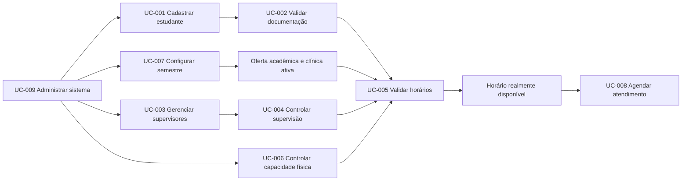

# Sistema de Gestão das Clínicas-Escola

[Início e recorte atual](../README.md) · [Design](design/README.md) · [Padrão Markdown](guia-markdown.md)

Documentação do Projeto 2 da Hackathon de Ciência da Computação 2026.2 da Faculdade Anhanguera de Guarapari.

| Informação         | Valor                              |
| ------------------ | ---------------------------------- |
| Status             | descoberta e especificação inicial |
| Versão             | 0.2.0                              |
| Última atualização | 14 de setembro de 2026             |
| MVP                | 14 a 18 de setembro de 2026        |

> [!NOTE]
> Esta documentação descreve o produto completo. A demonstração reduzida selecionada pela turma está no [README da raiz](../README.md); as nove UCs abaixo não estão todas incluídas nessa entrega.

<details>
<summary>Sumário — navegar pelas seções</summary>

- [Visão geral](#visão-geral)
- [Objetivo do Produto](#objetivo-do-produto)
- [Objetivo da Sprint](#objetivo-da-sprint)
- [Organização por casos de uso](#organização-por-casos-de-uso)
- [Fluxo principal do produto](#fluxo-principal-do-produto)
- [Escopo do MVP](#escopo-do-mvp)
- [Atores](#atores)
- [Convenções de identificação](#convenções-de-identificação)
- [Estados dos artefatos](#estados-dos-artefatos)
- [Método Scrum](#método-scrum)
- [Qualidade e referências adotadas](#qualidade-e-referências-adotadas)
- [Questões prioritárias para os stakeholders](#questões-prioritárias-para-os-stakeholders)
- [Fonte e referências](#fonte-e-referências)

</details>

## Visão geral

O produto será uma plataforma integrada para organizar estudantes, professores, preceptores, documentos, clínicas, consultórios, equipamentos e agendamentos da comunidade.

O sistema não será apenas uma agenda. Um horário somente poderá ser utilizado quando todas as condições forem satisfeitas simultaneamente:

1. o estudante estiver ativo, disponível e vinculado à disciplina ou ao estágio;
2. toda a documentação obrigatória do estudante estiver aprovada;
3. houver professor ou preceptor habilitado e disponível;
4. o limite de supervisão não tiver sido atingido;
5. a clínica possuir espaço, equipamento e capacidade disponíveis;
6. o horário pertencer à configuração semestral vigente.

## Objetivo do Produto

> Permitir que a instituição organize atendimentos seguros das clínicas-escola por meio de regras configuráveis, impedindo conflitos acadêmicos, documentais, humanos e físicos durante o agendamento.

## Objetivo da Sprint

> Demonstrar, com dados fictícios, um agendamento válido de ponta a ponta, oferecido somente quando estudante, documentação, supervisor, horário acadêmico e capacidade física forem simultaneamente elegíveis, incluindo a configuração essencial pelo perfil Master.

## Organização por casos de uso

Cada requisito mínimo do desafio corresponde a uma pasta de caso de uso. Dentro de cada pasta ficam todos os documentos específicos daquele comportamento.

| Caso de uso                                  | Requisito do desafio                    | Prioridade | Pasta                                                       |
| -------------------------------------------- | --------------------------------------- | ---------- | ----------------------------------------------------------- |
| UC-001 — Cadastrar estudante                 | Cadastro dos estudantes                 | Must       | [UC-001](UC-001-cadastrar-estudante/README.md)              |
| UC-002 — Validar documentação                | Validação obrigatória da documentação   | Must       | [UC-002](UC-002-validar-documentacao/README.md)             |
| UC-003 — Gerenciar supervisores              | Cadastro de professores e preceptores   | Must       | [UC-003](UC-003-gerenciar-supervisores/README.md)           |
| UC-004 — Controlar capacidade de supervisão  | Capacidade de supervisão                | Must       | [UC-004](UC-004-controlar-capacidade-supervisao/README.md)  |
| UC-005 — Validar compatibilidade de horários | Compatibilidade com horários acadêmicos | Must       | [UC-005](UC-005-validar-compatibilidade-horarios/README.md) |
| UC-006 — Controlar capacidade física         | Capacidade física da clínica            | Must       | [UC-006](UC-006-controlar-capacidade-fisica/README.md)      |
| UC-007 — Configurar semestre                 | Configuração por semestre               | Must       | [UC-007](UC-007-configurar-semestre/README.md)              |
| UC-008 — Agendar atendimento                 | Agendamento pela comunidade             | Must       | [UC-008](UC-008-agendar-atendimento/README.md)              |
| UC-009 — Administrar sistema                 | Perfil Master                           | Must       | [UC-009](UC-009-administrar-sistema/README.md)              |

O protótipo de interface correspondente a estes casos de uso está em [design/README.md](design/README.md).

### Estrutura interna obrigatória

Todas as pastas de UC possuem a mesma estrutura:

```text
UC-NNN-nome-do-caso/
├── README.md
├── caso-de-uso.md
├── historias-de-usuario.md
├── requisitos-funcionais.md
├── requisitos-nao-funcionais.md
├── regras-de-negocio.md
└── criterios-de-aceitacao.md
```

| Documento                      | Finalidade                                                                |
| ------------------------------ | ------------------------------------------------------------------------- |
| `README.md`                    | índice, objetivo, fonte, atores, dependências e pendências da UC          |
| `caso-de-uso.md`               | fluxo principal, alternativas, exceções e pós-condições                   |
| `historias-de-usuario.md`      | valor esperado na linguagem dos usuários e ordem no backlog               |
| `requisitos-funcionais.md`     | comportamentos obrigatórios e rastreáveis da UC                           |
| `requisitos-nao-funcionais.md` | qualidade, segurança, desempenho, acessibilidade e privacidade aplicáveis |
| `regras-de-negocio.md`         | invariantes e políticas do domínio                                        |
| `criterios-de-aceitacao.md`    | cenários verificáveis em `Dado/Quando/Então`                              |

## Fluxo principal do produto



## Escopo do MVP

### Incluído

- as nove UCs obrigatórias;
- autenticação e autorização dos usuários internos;
- bloqueio do estudante com pendência documental;
- prevenção de conflito e sobre-alocação;
- consulta, criação, confirmação e cancelamento do agendamento;
- dados fictícios ou devidamente anonimizados;
- documentação, testes e demonstração do fluxo principal.

### Fora do MVP inicial

- chatbot inteligente;
- fila de espera;
- lista de presença;
- lembretes automáticos;
- dashboard e relatórios avançados;
- avaliação da experiência da comunidade;
- prontuário, diagnóstico, prescrição, pagamentos ou faturamento;
- implantação imediata em produção.

Os diferenciais somente serão iniciados após a conclusão do caminho crítico e mediante priorização do Product Owner.

## Atores

| Ator                     | Responsabilidade principal                                                      |
| ------------------------ | ------------------------------------------------------------------------------- |
| Estudante                | manter dados, disponibilidade e documentação e participar de horários elegíveis |
| Professor                | analisar documentos e supervisionar estudantes conforme sua capacidade          |
| Preceptor                | supervisionar estudantes dentro de sua área e disponibilidade                   |
| Comunidade               | consultar, agendar, confirmar e cancelar o próprio atendimento                  |
| Responsável pela clínica | manter a operação, os recursos e as capacidades sob sua responsabilidade        |
| Master                   | administrar usuários, permissões, catálogos e configurações semestrais          |

A matriz final de permissões ainda precisa ser validada. Nenhum papel deve receber acesso irrestrito apenas por conveniência.

## Convenções de identificação

| Prefixo | Artefato                | Exemplo                                      |
| ------- | ----------------------- | -------------------------------------------- |
| `UC`    | caso de uso             | `UC-008` Agendar atendimento                 |
| `US`    | história de usuário     | `US-008.01` Consultar horários disponíveis   |
| `RF`    | requisito funcional     | `RF-008.03` Criar agendamento                |
| `RNF`   | requisito não funcional | `RNF-008.CON-01` Concorrência da reserva     |
| `RN`    | regra de negócio        | `RN-008.02` Revalidar capacidade             |
| `CA`    | critério de aceitação   | `CA-008.03-01` Criar reserva válida          |
| `CT`    | caso de teste futuro    | `CT-008.03-01` Concorrência pela última vaga |

Os identificadores são imutáveis e nunca devem ser reutilizados, mesmo quando um item for cancelado.

## Estados dos artefatos

- `Rascunho`: conteúdo inicial ainda não validado;
- `Em refinamento`: sendo discutido com equipe ou stakeholder;
- `Pronto`: claro e testável para entrar no desenvolvimento;
- `Em desenvolvimento`: incluído no Sprint Backlog;
- `Em validação`: implementação em teste ou aceite;
- `Concluído`: atende à Definition of Done;
- `Adiado`: permanece no Product Backlog, fora da Sprint;
- `Cancelado`: não será realizado, com justificativa registrada.

## Método Scrum

A Hackathon será tratada como uma Sprint única de cinco dias. As atividades diárias do edital são etapas e checkpoints dentro da Sprint, não cinco Sprints independentes.

| Data  | Foco                          | Resultado esperado                                 |
| ----- | ----------------------------- | -------------------------------------------------- |
| 14/09 | Sprint Planning e descoberta  | objetivo, atores, UCs, riscos e backlog ordenado   |
| 15/09 | projeto da solução            | protótipos, dados, arquitetura e refinamento       |
| 16/09 | desenvolvimento               | primeiro caminho executável de ponta a ponta       |
| 17/09 | testes e aperfeiçoamento      | evidências, correções, documentação e ensaio       |
| 18/09 | Sprint Review e retrospectiva | incremento demonstrado, feedback e próximos passos |

Responsabilidades a preencher pela equipe:

- **Product Owner:** `A definir`;
- **Scrum Master:** `A definir`;
- **Developers:** `A definir`;
- **Stakeholders validadores:** `A definir`.

### Definition of Ready

Uma história poderá ser selecionada quando tiver ator, valor, escopo, critérios testáveis, regras, dependências, riscos e dados de teste conhecidos, além de tamanho compatível com o tempo restante. Esta é uma política complementar da equipe, não um artefato oficial do Scrum.

### Definition of Done

Uma história somente estará concluída quando:

- todos os critérios de aceitação aplicáveis tiverem sido atendidos;
- regras de negócio e fluxos de erro tiverem sido testados;
- código estiver integrado e revisado;
- testes pertinentes estiverem passando;
- autenticação, autorização, privacidade e validação de entradas tiverem sido verificadas;
- não houver defeito crítico conhecido;
- a documentação da UC e sua rastreabilidade estiverem atualizadas;
- o fluxo puder ser demonstrado de forma reproduzível com dados fictícios.

## Qualidade e referências adotadas

- ISO/IEC 25010:2023 para atributos de qualidade;
- WCAG 2.2 nível AA como alvo de acessibilidade;
- OWASP ASVS 5.0.0 como referência de controles verificáveis;
- OWASP API Security Top 10:2023 para riscos de APIs;
- LGPD, minimização de dados e privacidade desde a concepção;
- Guia do Scrum vigente, publicado em novembro de 2020.

Documentos e informações de atendimentos podem conter dados pessoais sensíveis. Antes de qualquer piloto real, a instituição deverá validar base legal, finalidade, acesso, retenção, descarte, agentes de tratamento e resposta a incidentes. Esta documentação não substitui avaliação jurídica ou de segurança para produção.

## Questões prioritárias para os stakeholders

1. Quais serviços cada clínica oferece e qual é a duração de cada atendimento?
2. Quem define e quem pode aprovar a documentação de cada atividade?
3. Professor e preceptor possuem as mesmas permissões?
4. O estudante escolhe o horário ou é alocado pela coordenação?
5. Quais dados mínimos da comunidade são necessários para agendar?
6. Qual é a regra de confirmação, cancelamento, prazo e falta?
7. O que acontece com reservas existentes quando o semestre é alterado?
8. Equipamentos são unidades identificadas ou apenas quantidades por tipo?
9. Quais operações precisam de auditoria e por quanto tempo?

## Fonte e referências

- Documento `Hackathon_Ciencia_da_Computacao_Anhanguera_Guarapari_2026_2.pdf`, páginas 6 a 8; requisitos gerais nas páginas 12 a 14.
- [Guia oficial do Scrum](https://scrumguides.org/scrum-guide.html).
- [ISO/IEC 25010:2023](https://www.iso.org/standard/78176.html).
- [WCAG 2.2](https://www.w3.org/TR/WCAG22/).
- [OWASP ASVS 5.0.0](https://owasp.org/projects/asvs).
- [OWASP API Security Top 10 — 2023](https://api-security.owasp.org/editions/2023/en/0x00-header/).
- [Lei nº 13.709/2018 — LGPD](https://www.planalto.gov.br/ccivil_03/_ato2015-2018/2018/lei/l13709compilado.htm).
- [Guia da ANPD sobre segurança da informação](https://www.gov.br/anpd/pt-br/documentos-e-publicacoes/guia-vf.pdf).
